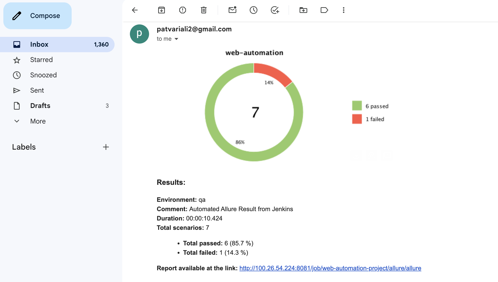
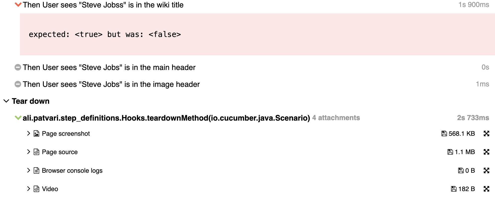
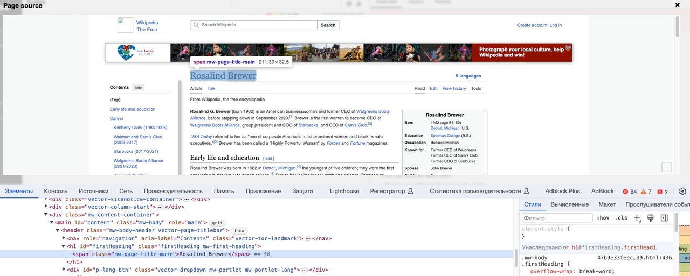

# 🌐🤖Web-Automation Framework example 
Example of (Cucumber + JUnit5 + Selenium + Maven + Allure Reports) framework
 
Project with few cucumber scenarios testing Wiki search functionality
 
❗New: log in using cookies to make UI tests faster
 
❗New: added functionality for failed test case:
* screenshots
* page source(html+css)
* browser error logs
* recorded test executon

❗New: Automaticly sending result on any messenger(Telegram, Slack, Email, Skype, Mattermost, Discord, Loop, Rocket.Chat):

 

  

## 📍 Example --> [See generated result](https://patvariali.github.io/Selenium_Junit5_Cucumber_Example)

# You can see attached screenshot, page source in HTML+CSS, browser logs and recorded video of failed test

 

  

# 🛠 You can debug your test case directly from source page, using DevTool

 

  

## Built With

* [Selenium](https://www.selenium.dev/) - The web automation tool
* [Slenoid](https://aerokube.com/selenoid/) - Selenoid is a powerful Golang implementation of original Selenium hub code
* [Jenkins](https://www.jenkins.io/) - CI/CD service
* [Maven](https://maven.apache.org/) - Dependency Management
* [Junit5](https://junit.org/junit5/) - Programmer-friendly testing framework for Java and the JVM
* [Cucumber](https://cucumber.io/) - The most popular tool for BDD
* [Maven](https://maven.apache.org/) - Dependency Management
* [Allure Reports](https://allurereport.org/) - #1 Automation Test Reporting Tool
* [Github Actions](https://github.com/features/actions) - CI/CD tool from GitHub

In this project were implemented:

* Page Object Model
* Page Factory model
* Static WebDriver with Singleton implementation
* Reading .properties file
* Using rerun plugin for storing all failed tests under rerun.txt file
* Implemented 'Abstraction' providing universal utility methods
* Parallel testing with Junit5, multiple threads in same class (Creating pool of drivers for support Singleton)
* Detailed Allure reports with attaching screenshots, browser logs, video, page source of failed steps using Hooks from Cucumber
* Github Actions, and publishing them automaticly in gitHub pages in the same repository
* Implemented CI/CD pipeline using Jenkins and Selenium Grid 
* [See generated result](https://patvariali.github.io/Selenium_Junit5_Cucumber/3/)

etc...
